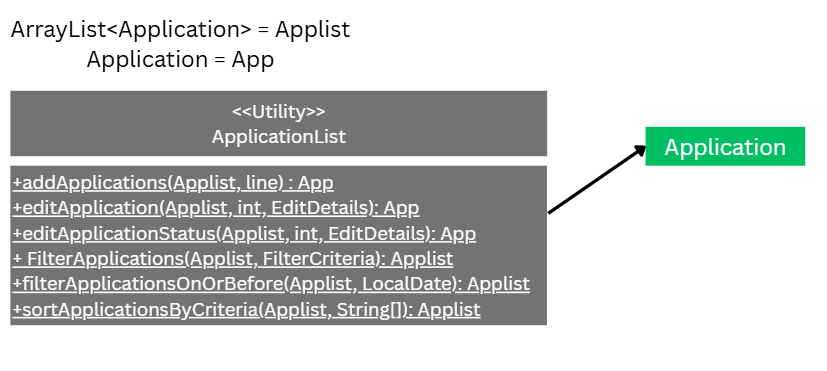

# Developer Guide

## Table of Contents

1. [Acknowledgements](#acknowledgements)
2. [Setting up, getting started](#setting-up-getting-started)
3. [Design](#design)
   - [Architecture](#architecture)
   - [Ui component](#ui-component)
   - [Storage component](#storage-component)
   - [Parser component](#parser-component)
   - [Application component](#application-component)
   - [Application List component](#application-list-component)
   - [FilterCriteria component](#filtercriteria-component)
   - [EditDetails component](#editdetails-component)
4. [Implementation](#implementation)
   - [Add feature](#add-feature)
   - [List feature](#list-feature)
   - [Edit feature](#edit-feature)
   - [Filter feature](#filter-feature)
   - [Remind feature](#remind-feature)
   - [Delete feature](#delete-feature)
   - [Sort feature](#sort-feature)
   - [Undo feature](#undo-feature)
   - [Summary feature](#summary-feature)
5. [Documentation, logging, testing, configuration, dev-ops](#documentation-logging-testing-configuration-dev-ops)
6. [Appendix: Requirements](#appendix-requirements)
   - [Product scope](#product-scope)
   - [User stories](#user-stories)
   - [Use cases](#use-cases)
   - [Non-Functional Requirements](#non-functional-requirements)
   - [Glossary](#glossary)
7. [Appendix: Instructions for manual testing](#appendix-instructions-for-manual-testing)
   - [Launch and shutdown](#launch-and-shutdown)
   - [Deleting an application](#deleting-an-application)
   - [Saving data](#saving-data)

---

## Acknowledgements

This project was developed as part of the CS2113 Team Project at the National University of Singapore.

The project structure and development workflow follow the guidelines from the SE-EDU project template:
https://se-education.org/

The project focuses on the learning of Object-Oriented Programming (OOP) principles and good coding practices for
collaborative software development in a team environment.

The project was developed using Java and standard software engineering tools such as Git for version control and GitHub
for project management and collaboration.

Java standard libraries such as `java.util`, `java.io`, and `java.time` were used in the implementation.

---

## Setting up, getting started

{Provide step-by-step instructions for setting up the development environment and getting started with the project.}

---

## Design

### Architecture

The ***Architecture Diagram*** given above explains the high-level design of the App. The architecture of **InternTrack
** follows a layered design pattern with the following main components:

* InternTrack: Responsible for the app's lifecycle. It initializes components in the correct sequence at launch and
  ensures a clean shutdown by invoking necessary cleanup methods. It also orchestrates the application flow.
* UI (Ui): Handles user input and output via the command-line interface
* Parser: Processes user commands and handle back to InternTrack
* Model (Application): Maintains the in-memory data structure for applications
* Storage (Storage): Manages persistence of application data to disk
* Common : A suite of utility classes (e.g.,ApplicationList, EditDetails, FilterCriteria) shared across all components.
  The sequence of interaction follows a clear flow: User input → UI → Logic (Parser) → Model manipulation → Storage
  persistence.

## Application List component

The ApplicationList component is a stateless utility class that functions as a logic middleware. 

It does not maintain its own state or store the application data internally; instead, it provides a suite of pure functions that perform operations (adding, filtering, sorting, editing) on an ArrayList<Application> passed in by the caller. 

This decoupling ensures that the data storage remains independent of the processing logic.

---

### Ui component

{Description of Ui component will be added here.}

---

### Storage component

#### Overview

The `Storage` component is responsible for persisting application data to disk and loading it back into memory during startup. This component bridges the gap between the in-memory model and the file system, ensuring data durability and consistency.

#### Design Considerations

##### Aspect 2: When to Persist Data to Storage

**Alternative 1 (Current Choice):** Auto-save to `Storage` immediately after every successful command that modifies the model (add, edit, delete).

*Pros:*
- Prevents data loss if the application crashes or is forcefully terminated
- Guarantees consistency between the in-memory model and on-disk state
- Simplifies error handling: if the save fails, the entire operation can be considered incomplete and rolled back
- Users never lose work; changes are persisted immediately

*Cons:*
- Increased disk I/O operations may cause slight performance overhead
- Inefficient for batch operations (multiple adds followed by a save would write to disk multiple times)
- Disk write latency could delay user feedback

**Alternative 2:** Only save to `Storage` when the user issues an explicit `save` command or when the application exits normally.

*Pros:*
- Better performance: disk writes are minimized and can be batched
- More predictable timing—saves only happen at user-defined points
- Aligns with traditional desktop application workflows (e.g., spreadsheets require explicit saves)

*Cons:*
- **High risk of data loss** if the application is force-closed without an explicit save
- User must remember to save, placing responsibility on the user
- No guarantee of data consistency throughout a session
- Less suitable for tasks that users perform casually or repetitively

**Rationale for Current Choice:** For an internship application tracker, data loss is unacceptable. Immediate persistence ensures that every application a user enters is permanently saved. While this incurs a small performance cost, the safety guarantee is worth the trade-off given the application's domain.

---

##### Aspect 3: File Format for Persistent Storage

**Alternative 1 (Current Choice):** Store applications in a plain-text file using a pipe-delimiter (`|`) format.

*Pros:*
- Human-readable and easily debuggable—users can directly examine and understand the file contents
- No external library dependencies required
- Simple parsing and serialization logic
- Fast I/O performance for small to medium datasets
- Minimal file size overhead compared to structured formats

*Cons:*
- Not scalable if nested or complex data structures are added later
- If the delimiter character (`|`) appears in data fields, it must be escaped, complicating both serialization and deserialization
- Limited support for special characters; encoding issues may arise
- Fragile: manual edits to the file can easily corrupt the data format

**Alternative 2:** Store applications in JSON format.

*Pros:*
- Structured, widely supported format with standardized specifications
- Self-documenting: field names are included in the serialized data
- Easy to extend with new fields without breaking existing parsers
- Better handling of special characters, escape sequences, and nested objects
- Widely available libraries simplify parsing and serialization

*Cons:*
- Requires an external JSON library dependency (e.g., `gson`, `jackson`)
- Slightly slower parsing and serialization compared to plain text
- Larger file size due to formatting overhead and field name repetition
- Overkill for a simple, flat data structure like applications

**Alternative 3:** Use a database.

*Pros:*
- Supports complex queries, indexing, and relationships between entities
- Built-in data validation and type constraints
- Superior performance for large datasets (thousands of records)
- Allows for concurrent access and advanced features like transactions

*Cons:*
- Adds significant complexity and database library dependencies
- Overkill for a CLI application managing a small number of applications
- Harder to understand and debug compared to file-based approaches
- Requires knowledge of SQL and database administration
- Heavier resource footprint

**Rationale for Current Choice:** The plain-text pipe-delimited format is appropriate for an early-stage student project. It provides a good balance between simplicity, readability, and performance. If future requirements demand support for complex nested data or significantly larger datasets, migrating to JSON or a database would be straightforward.

---

### Parser component

#### Overview

The `Parser` component is responsible for interpreting user input and converting it into actionable commands. It validates user input and constructs domain objects (like `Application` instances) that represent the user's intentions.

#### Design Considerations

##### Aspect 1: Where the Application Object is Instantiated

**Alternative 1 (Current Choice):** Instantiate the complete `Application` object inside the `Parser.createApplication()` method, which is called by `ApplicationList.addApplications()`.

*Pros:*
- Parsing logic is centralized and reusable across commands
- `ApplicationList` is insulated from parsing concerns; it only knows about domain objects
- Clear separation of concerns between input parsing and model management
- Validation happens at a single point, reducing the risk of inconsistency

*Cons:*
- Parser is tightly coupled to the `Application` class structure
- Changes to the `Application` constructor signature require updating the parser
- If multiple ways to create `Application` objects are needed, code duplication may occur

**Alternative 2:** Pass raw, validated strings directly to `ApplicationList.addApplications()` and allow it to instantiate the `Application` object during the add operation.

*Pros:*
- Reduces coupling between the parser and the `Application` model
- `ApplicationList` has more control and flexibility over object instantiation
- Easier to support alternative `Application` creation paths

*Cons:*
- Violates the Single Responsibility Principle by mixing input parsing with model logic
- Duplicates validation logic if applications are created in multiple places
- Makes testing harder because the model layer must now understand input syntax
- Reduced code reusability across commands that need to create applications

**Rationale for Current Choice:** Centralizing instantiation in the parser improves testability and maintainability. Each component has a clear responsibility: the parser handles user input syntax, and the model layer handles data integrity.

---

### Application component

{Description of Application component will be added here.}

---

### Application List component

{Description of Application List component will be added here.}

---

### FilterCriteria component

{Description of FilterCriteria component will be added here.}

---

### EditDetails component

{Description of EditDetails component will be added here.}

---

## Implementation

## Application Initialization: Loading Persisted Data

Before any user interaction occurs, the application must load previously saved data from disk. This initialization step
is critical for demonstrating how the storage mechanism works bidirectionally (save and load).

When `InternTrack.main()` is invoked at startup:

1. An empty `userApplications` ArrayList is created in memory
2. Immediately, `Storage.loadApplications(userApplications)` is called
3. This method checks if the data directory (`./data/`) and file (`./data/applications.txt`) exist
4. If either is missing, they are created automatically (graceful initialization)
5. The file is read line by line; each line is passed to `Storage.parseFileString()`
6. `parseFileString()` deserializes the pipe-delimited format back into `Application` objects
7. Each deserialized `Application` is added to the in-memory `userApplications` list

By the time the user sees the welcome prompt, all previously saved applications are already in memory. This design
ensures:

* No data loss — All previous applications are restored at startup
* Consistency — The in-memory state matches the on-disk state at launch
* Error resilience — Malformed lines are logged and skipped rather than crashing the app

---

### Add feature

#### Proposed Implementation

The add command follows a 5-step pipeline:

1. Parsing — User input is tokenized and validated
2. Object Creation — A new `Application` entity is instantiated with default status
3. Model Update — The application is added to the in-memory list
4. Storage Persistence — The updated model is serialized to disk
5. User Feedback — Confirmation is displayed to the user

---

#### Detailed Walkthrough of Add Command

##### Step 1: Parsing User Input

When a user enters `add c/Google r/Software Engineer d/2024-03-31 ct/John Doe`,
the input is received by `Ui.readCommand()` and passed to `InternTrack.handleCommand()`.

This method inspects the command prefix and dispatches to `handleAddCommand()`.

The `Parser.createApplication()` method processes the raw input string:

* Uses a regex split pattern `(?=c/|r/|ct/|d/)` to tokenize by command prefixes
* Extracts mandatory fields: `c/` (Company) and `r/` (Role)
* Extracts optional fields: `d/` (Deadline in YYYY-MM-DD format) and `ct/` (Contact)
* Validates that mandatory fields are non-empty; if missing or empty, throws `InternTrackException`
* If a deadline is provided, parses it using `LocalDate.parse()`; invalid dates trigger an exception

---

##### Step 2: Object Creation and Default Initialization

Once parsing is successful, `Parser.createApplication()` instantiates a new `Application` object with the extracted
data.

Critically, the `Application` constructor automatically assigns a default status of "Pending" to all newly created
applications. This ensures every new application has a well-defined initial state.

---

##### Step 3: Model Update

The newly created `Application` object is returned to `ApplicationList.addApplications()`, which performs final
validation:

* Adds the application to the internal `userApplications` ArrayList
* Returns the newly added `Application`

---

##### Step 4: Storage Persistence

Immediately after the successful model update, `InternTrack.handleAddCommand()` calls
`Storage.saveApplications(userApplications)` to persist the updated list to disk.

This ensures in-memory and on-disk states remain synchronized.

The `Storage.saveApplications()` method:

1. Opens a `FileWriter` to `./data/applications.txt`
2. Iterates through all applications in the list
3. Converts each `Application` to a pipe-delimited string:
   `company|role|deadline|contact|status`
4. Writes all serialized applications to disk in a single operation
5. Null fields are represented as the string `"null"`

---

##### Step 5: User Feedback

Finally, `Ui.printAddApplication()` displays a confirmation message showing the added application details and the
updated total count.

---

##### Sequence Diagram illustrating the 5 steps above

---

### List feature

{Description of List feature implementation will be added here.}

---

### Edit feature

The `edit` command allows users to modify the status of an existing application.

Command format:

edit INDEX s/STATUS

Example:

edit 2 s/Accepted

Implementation steps:

1. `Parser.parseEditCommand()` extracts the index and new status.
2. The index is validated to ensure it exists in the application list.
3. `ApplicationList.editApplicationStatus()` retrieves the application.
4. The application's `setStatus()` method updates the status value.
5. `Storage.saveApplications()` persists the updated list.
6. `Ui.printEditSuccess()` displays confirmation to the user.

The `Application.setStatus()` method also performs validation to ensure that the status value is not null or empty.

This approach keeps validation within the model while command interpretation remains in the logic layer.

---

##### Sequence Diagram: Edit Command

---

### Filter feature

{Description of Filter feature implementation will be added here.}

---

### Remind feature

{Description of Remind feature implementation will be added here.}

---

### Delete feature

{Description of Delete feature implementation will be added here.}

---

### Sort feature

{Description of Sort feature implementation will be added here.}

---

### Undo feature

The `undo` command allows users to revert the most recent modification made to the application list.

Supported commands:

* add
* edit
* delete

Undo is implemented using a snapshot-based state restoration mechanism.

---

#### Snapshot Mechanism

Before executing any modifying command:

1. A deep copy of the current `userApplications` list is created.
2. The snapshot is pushed onto an undo history stack.

When the user executes `undo`:

1. The most recent snapshot is popped from the stack.
2. The application list is replaced with the snapshot.
3. The restored state is written to storage.

This guarantees the system returns to the exact state before the most recent change.

---

#### Example Workflow

add c/Google r/SWE Intern
delete 1
undo

Execution flow:

1. `add` stores a snapshot of the empty list then adds the application.
2. `delete` stores a snapshot then removes the application.
3. `undo` restores the previous snapshot.

The deleted application reappears in the list.

---

##### Sequence Diagram: Undo Command

---

#### Design Considerations

##### Aspect 4: Undo Implementation

**Alternative 1 (Current Choice): Snapshot-based restoration**

*Pros:*
- Simple and reliable
- Independent of command logic
- Guarantees correct state restoration

*Cons:*
- Increased memory usage

**Alternative 2: Command-based reversal**

*Pros:*
- More memory efficient

*Cons:*
- Significantly more complex
- Each command requires custom undo logic

**Rationale for Current Choice:** The snapshot approach was chosen for simplicity and reliability. In a student project managing a relatively small number of internship applications, the minimal memory overhead of storing snapshots is acceptable, and the guarantee of correct state restoration outweighs the efficiency benefits of command-based reversal. This design ensures that any future modifications to commands don't inadvertently break undo functionality.

---

### Summary feature

{Description of Summary feature implementation will be added here.}

---

## Documentation, logging, testing, configuration, dev-ops

{Documentation, logging, testing, configuration, and dev-ops information will be added here.}

---

## Appendix: Requirements

### Product scope

#### Target user profile

InternTrack is designed for students who apply to multiple internships and need a simple way to track their
applications.

The target users are:

- university students applying for internships
- users comfortable with command-line interfaces
- applicants managing many applications simultaneously

#### Value proposition

InternTrack allows students to efficiently track internship applications from the command line.

Instead of manually maintaining spreadsheets or notes, users can quickly record, update, and filter applications using
simple commands.

The application provides a lightweight and fast way to manage internship applications without requiring a graphical
interface.

---

### User stories

| Version | As a ...                                        | I want to ...                                     | So that I can ...                                                                     |
|---------|-------------------------------------------------|---------------------------------------------------|---------------------------------------------------------------------------------------|
| v1.0    | Year-2 CEG student applying to many internships | add a new application entry with company and role | keep all applications in one place                                                    |
| v1.0    | Forgetful applicant                             | record an application deadline                    | avoid missing closing dates                                                           |
| v1.0    | Student mass-applying during peak season        | list all applications                             | see what I have already applied to                                                    |
| v1.0    | Student mass-applying during peak season        | delete an application                             | remove outdated applications                                                          |
| v1.0    | Applicant networking with recruiters            | add a recruiter or HR contact                     | follow up with the correct person                                                     |
| v1.0    | Applicant tracking progress                     | record outcomes per round                         | track application progress                                                            |
| v1.0    | Applicant mass-applying mduring peak season     | filter outcomes of the current applying season    | filter application progress                                                           |
| v2.0    | An organized student                            | sort internship applications                      | organize and view them based on criteria                                              |
| v2.0    | A forgetful student                             | set a reminder for an internship application      | focus on important dates such as interviews, deadlines, or follow-ups                 |
| v2.0    | A error-prone student                           | undo my most recent add, edit, or delete command  | easily recover from accidental mistakes                                               |
| v2.0    | A data-driven student                           | view a summary of my internship applications      | see an overview of my application statuses, upcoming deadlines, and overall progress. 

---

### Use cases

{Use cases will be added here.}

---

### Non-Functional Requirements

1. The application should run on any system that supports Java 17 or above.
2. The application should store application data locally in a text file.
3. The system should respond to user commands within one second for typical usage.
4. The application should provide clear error messages for invalid inputs.
5. The application should support command-line usage without requiring a graphical interface.

---

### Glossary

*Application* – A job or internship submission to a company.

*Status* – The current stage of an application (e.g., Pending, Interview, Rejected, Accepted).

*CLI* – Command Line Interface used to interact with the application.

---

## Appendix: Instructions for manual testing

### Launch and shutdown

{Instructions for launching and shutting down the application will be added here.}

---

### Deleting an application

{Instructions for deleting an application will be added here.}

---

### Saving data

{Instructions for saving data will be added here.}

