# Developer Guide

## Table of Contents

1. [Acknowledgements](#acknowledgements)
2. [Setting up, getting started](#setting-up-getting-started)
3. [Design](#design)
   - [Architecture](#architecture)
   - [Ui component](#ui-component)
   - [Storage component](#storage-component)
   - [Parser component](#parser-component)
   - [Application component](#application-component)
   - [Application List component](#application-list-component)
   - [FilterCriteria component](#filtercriteria-component)
   - [EditDetails component](#editdetails-component)
4. [Implementation](#implementation)
   - [Add feature](#add-feature)
   - [List feature](#list-feature)
   - [Edit feature](#edit-feature)
   - [Filter feature](#filter-feature)
   - [Remind feature](#remind-feature)
   - [Delete feature](#delete-feature)
   - [Sort feature](#sort-feature)
   - [Undo feature](#undo-feature)
   - [Summary feature](#summary-feature)
5. [Appendix: Requirements](#appendix-requirements)
   - [Product scope](#product-scope)
   - [User stories](#user-stories)
   - [Use cases](#use-cases)
   - [Non-Functional Requirements](#non-functional-requirements)
   - [Glossary](#glossary)
6. [Appendix: Instructions for manual testing](#appendix-instructions-for-manual-testing)
   - [Launch and shutdown](#launch-and-shutdown)
   - [Saving data](#saving-data)

---

## Acknowledgements

This project was developed as part of the CS2113 Team Project at the National University of Singapore.

The project structure and development workflow follow the guidelines from the SE-EDU project template:
https://se-education.org/

The project focuses on the learning of Object-Oriented Programming (OOP) principles and good coding practices for
collaborative software development in a team environment.

The project was developed using Java and standard software engineering tools such as Git for version control and GitHub
for project management and collaboration.

Java standard libraries such as `java.util`, `java.io`, and `java.time` were used in the implementation.

---

## Setting up, getting started

1. Ensure that you have **Java 17 or above** installed.
2. Download the latest version of `InternTrack` from  
   https://github.com/AY2526S2-CS2113-W10-1/tp/releases/tag/v1.0
3. Open a terminal in the folder containing the jar file.
4. Run the application using:

```
java -jar InternTrack.jar
```

5. Type commands into the terminal and press Enter to execute them.

---

## Design

### Architecture

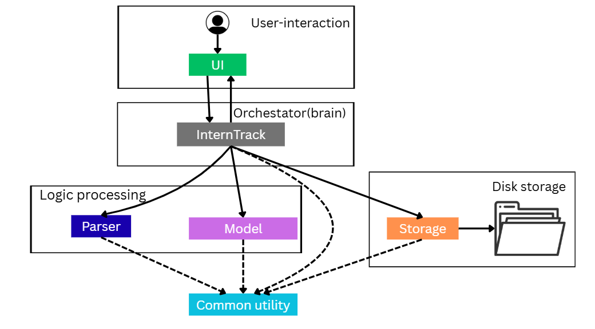

Some return arrows are omitted for clarity. The solid arrows are the real workflow of the application. Dashed arrows represent the dependency of some components to Common utilities

The ***Architecture Diagram*** given above explains the high-level design of the App. The architecture of **InternTrack** follows a layered design pattern with the following main components:

* InternTrack: Acts as the central coordinator of the application, handles the main application loop and command dispatching.
  Delegates tasks to other components such as Parser, ApplicationList, UI, and Storage.
* UI (Ui): Responsible for all user interactions via the command line, reads user input and displays output messages, does not contain business logic.
* Parser: Responsible for interpreting raw user input. Extracts command types and parameters (e.g., index, filters, fields) and return to InternTracker
* Model (ApplicationList): ApplicationList contains and operates the core business logic
* Storage (Storage): Manages persistence of application data to disk
* Common : A suite of utility classes (i.e. Application,EditDetails, FilterCriteria) shared across all components. They are responsible for supporting communication between components
  The sequence of interaction follows a clear flow: User input → UI → InternTracker → Parser/ApplicationList/Storage → UI
  persistence.

The architecture could be divided into few layers as the graph above, which is the User-interaction, orchestrator, logic processing and disk storage.

---

### UI Component

#### Overview

The `UI` component handles the interaction between the user and the application. It is responsible for reading user input from the console and displaying formatted output, including status messages, error alerts, and the visual representation of application data.


#### Class Diagram


#### Design Considerations

##### Aspect 1: Implementation of UI Methods (Static vs. Instance)

**Alternative 1 (Current Choice):** Use static methods for all UI operations.

* *Pros:*
    * Easy access from any part of the application without needing to pass a `Ui` object reference.
    * Simplifies the architecture for a Command Line Interface (CLI) where only one input/output stream exists.
    * Reduces memory overhead as no instance needs to be managed.
* *Cons:*
    * Harder to unit test using mocks compared to instance-based dependency injection.
    * Less flexible if the application were to support multiple concurrent user sessions or different output streams (e.g., GUI and CLI) simultaneously.

**Alternative 2:** Use an instance-based approach where a `Ui` object is instantiated and passed to various commands.

* *Pros:*
    * Improved testability through dependency injection (e.g., passing a `ByteArrayOutputStream` for testing).
    * Better adherence to Object-Oriented principles if state needs to be maintained within the UI.
* *Cons:*
    * Increases complexity by requiring the `Ui` instance to be passed through the call stack to every command that requires output.
    * Adds boilerplate code for a relatively straightforward CLI application.

**Rationale for Current Choice:** Given that InternTrack is a single-user CLI tool, the simplicity and global accessibility of static methods outweigh the benefits of an instance-based design. The current implementation provides a clean API for outputting data without cluttering command signatures.

---

##### Aspect 2: Handling of Data Formatting Logic

**Alternative 1 (Current Choice):** Centralize formatting logic within the `Ui` class (e.g., the private `printApplication` method).

* *Pros:*
    * Ensures a consistent visual style across different commands (List, Find, Sort, Remind).
    * The `Application` domain object remains "thin"—it stores data but doesn't need to know how to "draw" itself for a CLI.
    * Easier to modify the global look and feel (e.g., changing borders or list numbering) in one location.
* *Cons:*
    * The `Ui` class becomes more complex as it needs to understand the internal structure of the `Application` and `FilterCriteria` objects to display them.

**Alternative 2:** Have domain objects (like `Application`) provide their own formatted strings via `toString()` or a `toDisplayString()` method.

* *Pros:*
    * Better encapsulation of data; the object decides how it is represented.
    * Reduces the number of parameters passed to `Ui` methods.
* *Cons:*
    * Blurs the line between the Model and the View, potentially cluttering domain logic with UI-specific formatting code (like ANSI colors or specific padding).

**Rationale for Current Choice:** Centralizing formatting in the `Ui` component keeps the Model layer pure and focused on data integrity. By using a private helper method like `printApplication`, we achieve high reusability for displaying application details across various features like filtering and sorting while maintaining a single point of change for the UI design.

#### Implementation Details

The `Ui` component utilizes a `Scanner` for input and `System.out` for output. Key features include:

* **Standardized Headers:** Uses `BORDER` and specific welcome/goodbye methods to maintain a professional CLI experience.
* **Defensive Programming:** Employs `assert` statements to ensure that null lists or invalid application states are caught during development.
* **Context-Aware Feedback:** Provides specific feedback for different actions (e.g., `printAddApplication` vs `printEditApplication`) to keep the user informed of the state of their data.

---

### Storage component

**API**: [`Storage.java`](https://github.com/AY2526S2-CS2113-W10-1/tp/blob/master/src/main/java/seedu/interntrack/Storage.java)

#### Class Diagram

The following diagram illustrates the `Storage` component and its relationships:

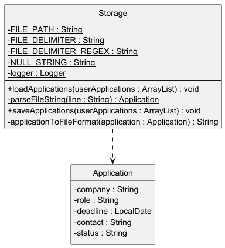

#### What the Storage Component Does

The `Storage` component handles persistence of application data through the following responsibilities:

- **Loads** application data from `./data/applications.txt` on application startup and deserializes each line into an `Application` object.
- **Saves** the full list of `Application` objects back to disk after every modifying command (add, edit, delete).
- **Depends on** the `Application` class.  It directly serializes and deserializes `Application` objects using a pipe-delimited format.
- **Handles gracefully** missing files and directories by creating them automatically on first run.
- **Skips and logs** malformed or unparseable records rather than crashing, ensuring robustness against corrupted data.
- **Uses** Java's `FileWriter` and `Scanner` classes for I/O operations and `LocalDate` for date parsing.

---

#### File Format Specification

The data file (`./data/applications.txt`) stores applications in a pipe-delimited format. Each line represents one application with exactly 5 fields:

| Field      | Index | Format              | Example                | Notes                        |
|------------|-------|---------------------|------------------------|------------------------------|
| Company    | 0     | Plain text          | `Google`               | Mandatory, non-empty         |
| Role       | 1     | Plain text          | `SWE Intern`           | Mandatory, non-empty         |
| Deadline   | 2     | ISO-8601 date       | `2025-08-01`           | Optional; `null` if not set  |
| Contact    | 3     | Plain text (email)  | `john.doe@google.com`  | Optional; `null` if not set  |
| Status     | 4     | Predefined enum     | `Applied`              | Mandatory; default is `Pending` |

**Example line:**
```
Google|SWE Intern|2025-08-01|john.doe@google.com|Applied
```

**Example with null fields:**
```
Microsoft|Azure Developer|null|contact.unknown@microsoft.com|Pending
```

---

#### Data Flow: Initialization and Persistence

When the application starts, `InternTrack` must first restore the user's previous state. Then, as the user performs actions, any modifications are immediately persisted to disk.

##### Load Operation: Application Startup

When `InternTrack.main()` runs, the very first step is to load existing application data from disk:

1. An empty `ArrayList<Application>` is initialized in memory
2. `Storage.loadApplications()` is called to restore saved data
3. The method checks if the `./data/` directory and `./data/applications.txt` file exist; if not, they are created automatically
4. Each non-empty line in the file is parsed via `parseFileString()`, which:
   - Splits the line using the pipe delimiter (`|`)
   - Validates that exactly 5 fields are present and correctly formatted
   - Creates an `Application` object with the parsed values
5. Valid applications are added to the in-memory list
6. Malformed or unparseable lines are logged as warnings and skipped, ensuring the application never crashes due to corrupted data

The following sequence diagram illustrates this process:

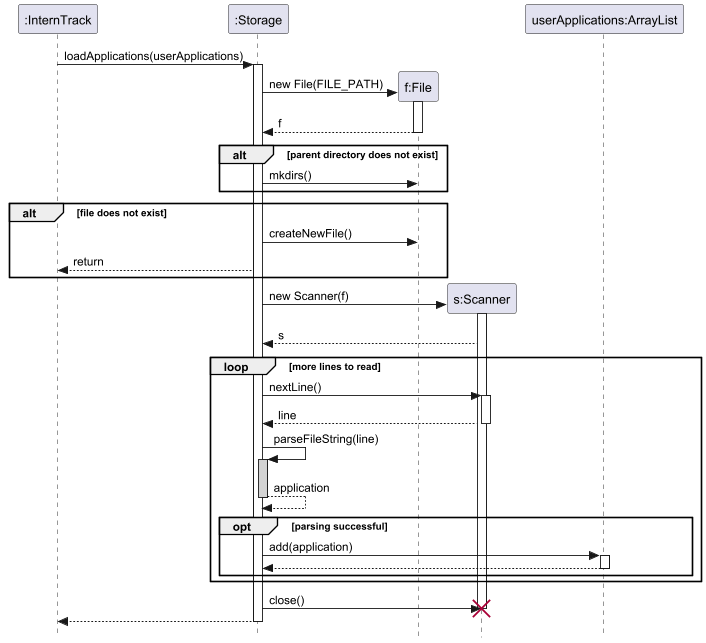

This approach ensures that users' data is always available when the application starts, and any corrupted entries are handled gracefully without preventing the application from loading successfully.

##### Save Operation: After User Actions

Once the application is running and the user performs an action that modifies the application list (such as `add`, `edit`, or `delete`), the changes must be persisted to disk immediately:

1. The user enters a command (e.g., `add c/Google r/SWE Intern`)
2. The `Parser` validates and parses the command
3. `InternTrack` creates a new `Application` object and adds it to the in-memory list
4. `Storage.saveApplications()` is called immediately to persist the change
5. Inside `saveApplications()`:
   - A `StringBuilder` accumulates the string representation of all applications
   - Each application is converted to pipe-delimited format via `applicationToFileFormat()`, which concatenates the five fields (company, role, deadline, contact, status) separated by the `|` delimiter
   - The entire accumulated string is written to `./data/applications.txt` in a single atomic file operation
   - On successful write, an informational log message is recorded

The following sequence diagram illustrates the save operation:

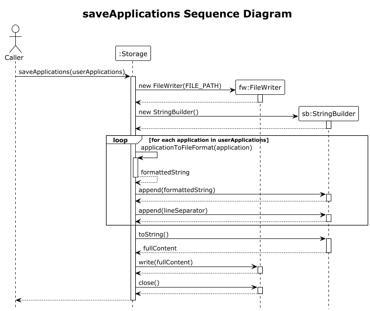

By saving immediately after every modifying operation, the application guarantees that the on-disk state always matches the in-memory state, preventing data loss in the event of a crash or unexpected termination.

---

#### Error Handling and Corrupted Data

The `Storage` component is designed to be resilient:

| Scenario | Behavior |
|----------|----------|
| Data directory missing | Created automatically at `./data/` |
| Applications file missing | Created automatically as empty file |
| Line has wrong number of fields | Line is skipped; warning logged to console |
| Deadline field is unparseable | Line is skipped; exception logged; application not added |
| Status field is invalid/blank | Line is skipped; validation ensures consistency |
| Entire file is corrupted | Application starts with empty list; user can add data fresh |

This design prioritizes **data integrity** and **user safety** over strict parsing — the application will never crash due to a corrupted data file, but will alert the user to problems via logging.

---

#### Design Considerations

##### Aspect 1: When to Persist Data to Storage

**Alternative 1 (Current Choice):** Auto-save to `Storage` immediately after every successful command that modifies the model (add, edit, delete).

*Pros:*
- Prevents data loss if the application crashes or is forcefully terminated
- Guarantees consistency between the in-memory model and on-disk state
- Simplifies error handling: if the save fails, the entire operation can be considered incomplete and rolled back
- Users never lose work; changes are persisted immediately

*Cons:*
- Increased disk I/O operations may cause slight performance overhead
- Inefficient for batch operations (multiple adds followed by a save would write to disk multiple times)
- Disk write latency could delay user feedback

**Alternative 2:** Only save to `Storage` when the user issues an explicit `save` command or when the application exits normally.

*Pros:*
- Better performance: disk writes are minimized and can be batched
- More predictable timing—saves only happen at user-defined points
- Aligns with traditional desktop application workflows (e.g., spreadsheets require explicit saves)

*Cons:*
- **High risk of data loss** if the application is force-closed without an explicit save
- User must remember to save, placing responsibility on the user
- No guarantee of data consistency throughout a session
- Less suitable for tasks that users perform casually or repetitively

**Rationale for Current Choice:** For an internship application tracker, data loss is unacceptable. Immediate persistence ensures that every application a user enters is permanently saved. While this incurs a small performance cost, the safety guarantee is worth the trade-off given the application's domain.

---

##### Aspect 2: File Format for Persistent Storage

**Alternative 1 (Current Choice):** Store applications in a plain-text file using a pipe-delimiter (`|`) format.

*Pros:*
- Human-readable and easily debuggable—users can directly examine and understand the file contents
- No external library dependencies required
- Simple parsing and serialization logic
- Fast I/O performance for small to medium datasets
- Minimal file size overhead compared to structured formats

*Cons:*
- Not scalable if nested or complex data structures are added later
- If the delimiter character (`|`) appears in data fields, it must be escaped, complicating both serialization and deserialization
- Limited support for special characters; encoding issues may arise
- Fragile: manual edits to the file can easily corrupt the data format

**Alternative 2:** Store applications in JSON format.

*Pros:*
- Structured, widely supported format with standardized specifications
- Self-documenting: field names are included in the serialized data
- Easy to extend with new fields without breaking existing parsers
- Better handling of special characters, escape sequences, and nested objects
- Widely available libraries simplify parsing and serialization

*Cons:*
- Requires an external JSON library dependency (e.g., `gson`, `jackson`)
- Slightly slower parsing and serialization compared to plain text
- Larger file size due to formatting overhead and field name repetition
- Overkill for a simple, flat data structure like applications

**Alternative 3:** Use a database.

*Pros:*
- Supports complex queries, indexing, and relationships between entities
- Built-in data validation and type constraints
- Superior performance for large datasets (thousands of records)
- Allows for concurrent access and advanced features like transactions

*Cons:*
- Adds significant complexity and database library dependencies
- Overkill for a CLI application managing a small number of applications
- Harder to understand and debug compared to file-based approaches
- Requires knowledge of SQL and database administration
- Heavier resource footprint

**Rationale for Current Choice:** The plain-text pipe-delimited format is appropriate for an early-stage student project. It provides a good balance between simplicity, readability, and performance. If future requirements demand support for complex nested data or significantly larger datasets, migrating to JSON or a database would be straightforward.

---

### Parser component

#### Overview

The `Parser` component is responsible for interpreting user input and converting it into actionable commands. It validates user input and constructs domain objects (like `Application` instances) that represent the user's intentions.

#### Design Considerations

##### Aspect 1: Where the Application Object is Instantiated

**Alternative 1 (Current Choice):** Instantiate the complete `Application` object inside the `Parser.createApplication()` method, which is called by `ApplicationList.addApplications()`.

*Pros:*
- Parsing logic is centralized and reusable across commands
- `ApplicationList` is insulated from parsing concerns; it only knows about domain objects
- Clear separation of concerns between input parsing and model management
- Validation happens at a single point, reducing the risk of inconsistency

*Cons:*
- Parser is tightly coupled to the `Application` class structure
- Changes to the `Application` constructor signature require updating the parser
- If multiple ways to create `Application` objects are needed, code duplication may occur

**Alternative 2:** Pass raw, validated strings directly to `ApplicationList.addApplications()` and allow it to instantiate the `Application` object during the add operation.

*Pros:*
- Reduces coupling between the parser and the `Application` model
- `ApplicationList` has more control and flexibility over object instantiation
- Easier to support alternative `Application` creation paths

*Cons:*
- Violates the Single Responsibility Principle by mixing input parsing with model logic
- Duplicates validation logic if applications are created in multiple places
- Makes testing harder because the model layer must now understand input syntax
- Reduced code reusability across commands that need to create applications

**Rationale for Current Choice:** Centralizing instantiation in the parser improves testability and maintainability. Each component has a clear responsibility: the parser handles user input syntax, and the model layer handles data integrity.

---

### Application component

The `Application` class represents a single internship application in the system.

Each application stores the following attributes:

- Company
- Role
- Deadline (optional)
- Contact (optional)
- Status

---

#### Key Design Features

- The status is automatically initialized to `"Pending"` when a new application is created.
- A copy constructor is implemented to support deep copying, which is essential for the undo feature.
- Setter methods include validation to ensure data integrity.

---

#### Design Considerations

##### Aspect: Default status initialization

**Alternative 1 (Current Choice): Assign default status `"Pending"` in constructor**

*Pros:*
- Ensures all applications have a valid initial state
- Prevents null or undefined status values
- Simplifies logic across the application

*Cons:*
- Less flexibility if different defaults are needed in the future

---

**Alternative 2: Require user to specify status explicitly**

*Pros:*
- More flexible
- Allows different workflows

*Cons:*
- Increases user effort
- Higher risk of invalid or missing status

**Rationale for Current Choice:**

A default status simplifies the user experience and ensures consistency across all applications.

---

### Application List component

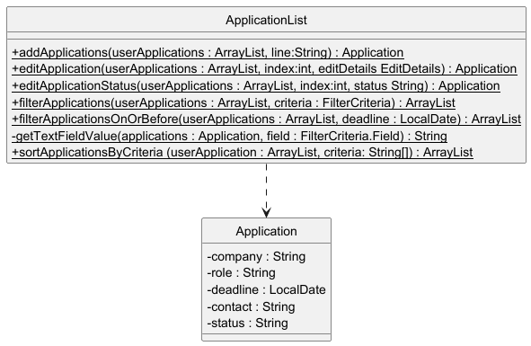

The diagram intentionally focuses on the static method of the ApplicationList that are exposed to be used by other components and show its dependency only, the method of common utility classes are not shown for clarity.

The ApplicationList component is a stateless utility class that functions as a logic middleware. 

It does not maintain its own state or store the application data internally; instead, it provides a suite of pure functions that perform operations (adding, filtering, sorting, editing) on an ArrayList<Application> passed in by the caller. 

This decoupling ensures that the data storage remains independent of the processing logic. 

---

### FilterCriteria component

`FilterCriteria` represents a single parsed filter condition.

It stores either:

- a text-based filter on `COMPANY`, `ROLE`, `CONTACT`, or `STATUS`, or
- a date-based filter on `DEADLINE`

This keeps the filter workflow type-safe without forcing the rest of the codebase to inspect raw command strings.
`Parser.parseFilterCriteria()` builds the object, `ApplicationList.filterApplications()` executes it, and
`Ui.printFilteredApplications()` uses `FilterCriteria.getSummary()` to generate user-facing messages.

---

### EditDetails component

`EditDetails` is a lightweight data carrier for optional updates parsed from an `edit` command.

Each field defaults to `null` when it is not being edited. This lets the parser return a single object regardless of
how many fields the user wants to update, and lets `ApplicationList.editApplication()` apply only the fields that were
actually supplied.

The `hasUpdates()` method acts as a guard against no-op edit commands.

---

## Implementation


## Application Initialization: Loading Persisted Data

Before any user interaction occurs, the application must load previously saved data from disk. This initialization step
is critical for demonstrating how the storage mechanism works bidirectionally (save and load).

When `InternTrack.main()` is invoked at startup:

1. An empty `userApplications` ArrayList is created in memory
2. Immediately, `Storage.loadApplications(userApplications)` is called
3. This method checks if the data directory (`./data/`) and file (`./data/applications.txt`) exist
4. If either is missing, they are created automatically (graceful initialization)
5. The file is read line by line; each line is passed to `Storage.parseFileString()`
6. `parseFileString()` deserializes the pipe-delimited format back into `Application` objects
7. Each deserialized `Application` is added to the in-memory `userApplications` list

By the time the user sees the welcome prompt, all previously saved applications are already in memory. This design
ensures:

* No data loss — All previous applications are restored at startup
* Consistency — The in-memory state matches the on-disk state at launch
* Error resilience — Malformed lines are logged and skipped rather than crashing the app

---

### Add feature

#### Implementation

The add command follows a 5-step pipeline:

1. Parsing — User input is tokenized and validated
2. Object Creation — A new `Application` entity is instantiated with default status
3. Model Update — The application is added to the in-memory list
4. Storage Persistence — The updated model is serialized to disk
5. User Feedback — Confirmation is displayed to the user

---

#### Detailed Walkthrough of Add Command

##### Step 1: Parsing User Input

When a user enters `add c/Google r/Software Engineer d/2024-03-31 ct/John Doe`,
the input is received by `Ui.readCommand()` and passed to `InternTrack.handleCommand()`.

This method inspects the command prefix and dispatches to `handleAddCommand()`.

The `Parser.createApplication()` method processes the raw input string:

* Uses a regex split pattern `(?=c/|r/|ct/|d/)` to tokenize by command prefixes
* Extracts mandatory fields: `c/` (Company) and `r/` (Role)
* Extracts optional fields: `d/` (Deadline in YYYY-MM-DD format) and `ct/` (Contact)
* Validates that mandatory fields are non-empty; if missing or empty, throws `InternTrackException`
* If a deadline is provided, parses it using `LocalDate.parse()`; invalid dates trigger an exception

---

##### Step 2: Object Creation and Default Initialization

Once parsing is successful, `Parser.createApplication()` instantiates a new `Application` object with the extracted
data.

Critically, the `Application` constructor automatically assigns a default status of "Pending" to all newly created
applications. This ensures every new application has a well-defined initial state.

---

##### Step 3: Model Update

The newly created `Application` object is returned to `ApplicationList.addApplications()`, which performs final
validation:

* Adds the application to the internal `userApplications` ArrayList
* Returns the newly added `Application`

---

##### Step 4: Storage Persistence

Immediately after the successful model update, `InternTrack.handleAddCommand()` calls
`Storage.saveApplications(userApplications)` to persist the updated list to disk.

This ensures in-memory and on-disk states remain synchronized.

The `Storage.saveApplications()` method:

1. Opens a `FileWriter` to `./data/applications.txt`
2. Iterates through all applications in the list
3. Converts each `Application` to a pipe-delimited string:
   `company|role|deadline|contact|status`
4. Writes all serialized applications to disk in a single operation
5. Null fields are represented as the string `"null"`

---

##### Step 5: User Feedback

Finally, `Ui.printAddApplication()` displays a confirmation message showing the added application details and the
updated total count.

---

##### Sequence Diagram illustrating the 5 steps above

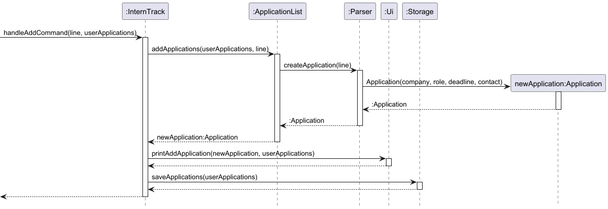

---


### List feature

The `list` command allows users to list every existing application.

Command format:

list

Implementation: `Ui.printAllApplications()` to format and display every existing applications to user.

##### Sequence Diagram: List Command

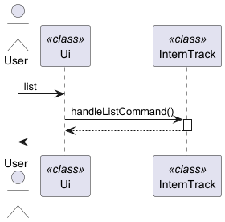

---

### Edit feature

The `edit` command allows users to modify one or more fields of an existing application.

Command format:

edit INDEX [c/COMPANY] [r/ROLE] [d/DEADLINE] [ct/CONTACT] [s/STATUS]

Example:

edit 2 c/Google Singapore s/Interview

Implementation steps:

1. `InternTrack.handleEditCommand()` receives the raw command and saves the current state for undo.
2. `Parser.parseEditIndex()` extracts and validates the 1-based index.
3. `Parser.parseEditDetails()` tokenizes the remaining prefixed fields and builds an `EditDetails` object.
4. The parser rejects duplicate prefixes and empty values before any model mutation occurs.
5. `ApplicationList.editApplication()` validates the index and applies only the non-null updates.
6. `Storage.saveApplications()` persists the updated list.
7. `Ui.printEditApplication()` displays the updated application.

`Parser.parseEditDetails()` supports these prefixes:

- `c/` for company
- `r/` for role
- `d/` for deadline
- `ct/` for contact
- `s/` for status

If no editable field is supplied, `ApplicationList.editApplication()` throws `InternTrackException` with
`Provide at least one field to edit.`

#### Design Considerations

**Aspect: Representing multiple optional edits**

**Alternative 1 (Current Choice):** Parse all supplied fields into a dedicated `EditDetails` object.

*Pros:*
- keeps `InternTrack` and `ApplicationList` independent from raw command syntax
- scales cleanly as more editable fields are added
- makes duplicate-field and empty-value validation explicit in one place

*Cons:*
- introduces one extra abstraction for a relatively small command

**Alternative 2:** Pass each possible field as a separate argument through the call chain.

*Pros:*
- fewer supporting classes

*Cons:*
- method signatures become noisy and error-prone
- harder to maintain as editable fields grow
- weaker grouping of related validation logic

**Rationale for Current Choice:** `EditDetails` is the cleanest way to model a partial update. It preserves separation of
concerns: parsing stays in `Parser`, update logic stays in `ApplicationList`, and the model only exposes field setters.

---

##### Sequence Diagram: Edit Command

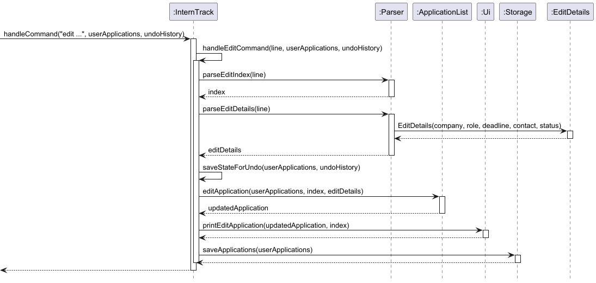

---

### Filter feature

The `filter` command allows users to view applications matching exactly one criterion.

Command formats:

filter c/COMPANY
filter r/ROLE
filter d/DEADLINE
filter ct/CONTACT
filter s/STATUS

Examples:

filter s/Pending
filter d/2026-04-10

Implementation steps:

1. `InternTrack.handleFilterCommand()` passes the raw command to `Parser.parseFilterCriteria()`.
2. `Parser.parseFilterCriteria()` tokenizes prefixed values and enforces that exactly one field is provided.
3. The parser converts the field into a `FilterCriteria` object.
4. `ApplicationList.filterApplications()` evaluates the criterion:
   - text fields use case-insensitive equality
   - deadline filters delegate to `filterApplicationsOnOrBefore()`
5. `Ui.printFilteredApplications()` renders the matching subset without changing application order or persisted data.

For deadline filtering, the current implementation treats `d/DATE` as "deadline on or before DATE". This is different
from text filters, which require exact case-insensitive matches.

#### Design Considerations

**Aspect: Number of criteria accepted per filter command**

**Alternative 1 (Current Choice):** Accept exactly one filter criterion.

*Pros:*
- simple command syntax and straightforward user feedback
- avoids introducing boolean operator semantics (`AND`/`OR`) too early
- keeps the filtering logic easy to test

*Cons:*
- users cannot compose multi-condition filters in one command

**Alternative 2:** Allow multiple criteria in a single filter command.

*Pros:*
- more expressive querying

*Cons:*
- requires defining operator semantics and precedence
- increases parser complexity and UI messaging complexity

**Rationale for Current Choice:** A single criterion matches the current project scope and keeps the command predictable.
If compound filtering becomes necessary later, the existing `FilterCriteria` abstraction provides a reasonable base to
extend.

---

### Remind feature

####  Implementation

The `remind` command helps users stay on top of upcoming application deadlines by displaying all applications with deadlines within N days from today (default: 7 days).

The remind feature is facilitated by the following key components:

- **Parser** (`Parser#parseRemindDays()`) — Parses and validates the number of days from user input
- **ApplicationList** (`ApplicationList#filterApplicationsOnOrBefore()`) — Filters applications by deadline
- **Ui** (`Ui#printUpcomingDeadlines()`) — Displays the filtered applications
- **InternTrack** (`InternTrack#handleRemindCommand()`) — Orchestrates the remind command workflow

#### How the Remind Feature Works

Given below is an example usage scenario and how the remind feature behaves:

**Step 1:** User has 3 applications: Google (deadline Apr 3), Microsoft (deadline Apr 5), Amazon (deadline Apr 15). Today is Apr 1.

**Step 2:** User executes `remind 5` to see applications due within the next 5 days.

**Step 3:** `InternTrack#handleRemindCommand()` is invoked:
1. Calls `Parser#parseRemindDays("remind 5")` which returns `5`
2. Calculates cutoff date: `LocalDate.now().plusDays(5)` = Apr 6
3. Calls `ApplicationList#filterApplicationsOnOrBefore(userApplications, Apr 6)` to filter the list
4. For each application, checks: `if (deadline != null && !deadline.isAfter(Apr 6))` to include it
5. Returns filtered list: Google (Apr 3) and Microsoft (Apr 5); excludes Amazon (Apr 15)

**Step 4:** `Ui#printUpcomingDeadlines()` displays the result:
```
You have 2 applications due in the next 5 days (up to 2026-04-06):
1. Software Engineer at Google is Pending. Apply by 2026-04-03.
2. Data Analyst at Microsoft is Pending. Apply by 2026-04-05.
```

#### Error Handling

The `Parser#parseRemindDays()` method validates input and handles error cases:

| Error Case | Behavior |
|---|---|
| Days parameter ≤ 0 | `InternTrackException` thrown with message: "Number of days must be greater than 0." |
| Non-integer parameter | `InternTrackException` thrown with message: "Days must be a valid number. Use format: remind [DAYS]" |
| No parameter provided | Defaults to 7 days without exception |
| No applications match deadline criteria | `Ui#printUpcomingDeadlines()` displays: "No applications due in the next N days." |

#### Design Considerations

**Aspect: Default Behavior**

*Alternative 1 (current choice): Default to 7 days if no parameter provided*
- Pros: Convenient for the most common use case (weekly planning); reduces typing
- Cons: Users may not expect the default

*Alternative 2: Require explicit days parameter*
- Pros: Forces explicit intent; clearer semantics
- Cons: Less convenient; more typing required

**Rationale**: Weekly planning is the most natural checking interval for internship deadlines. The default of 7 days balances convenience with clarity.

---

**Aspect: Deadline Cutoff Inclusivity**

*Alternative 1 (current choice): Include deadlines "on or before" the cutoff date (inclusive)*
- Pros: Aligns with user expectation ("what do I need to do by then?"); safer approach
- Cons: May include applications that are already overdue

*Alternative 2: Exclude applications on the cutoff date (exclusive)*
- Pros: Avoids including the boundary date itself
- Cons: Users could miss deadline applications on the cutoff date if they misinterpret

**Rationale**: It is safer to over-remind than under-remind. Missing a deadline is worse than showing one extra application.

---

### Delete Feature

The `delete` command allows users to remove an existing internship application from their tracking list using its displayed index.

---

#### Implementation

The deletion process is managed by `InternTrack#handleDeleteCommand`. It coordinates the validation, state preservation, and removal logic.

When a user executes a delete command:
1.  **Index Parsing:** The `Parser` extracts the target index from the user's input string.
2.  **Validation:** The system checks if the index is within the bounds of the current `userApplications` list.
3.  **State Preservation:** `saveStateForUndo` is called to push a deep-copy snapshot of the list onto the `undoHistory` stack.
4.  **Removal:** The application is removed from the `ArrayList<Application>`.
5.  **Feedback & Persistence:** The `Ui` displays the details of the removed application, and `Storage` immediately updates the local data file to reflect the change.

---

#### Error Handling

The delete feature specifically handles the following error cases via `InternTrackException`:

* **Non-numeric Input:** If the user provides a non-integer (e.g., `delete abc`), the `Parser` throws an exception.
* **Out of Bounds:** If the index is negative or greater than/equal to the list size (e.g., `delete 99` when only 5 applications exist), the command is aborted with the message:
    > `"Invalid application index."`

---

#### Design Considerations

##### Aspect: Deletion target identification

**Alternative 1 (Current Choice): Index-based deletion**
* *Pros:* Fast and unambiguous. Users can easily see the index from the `list` command output.
* *Cons:* Requires the user to view the list first to ensure they have the correct index.

**Alternative 2: Name-based deletion (e.g., `delete Google`)**
* *Pros:* More intuitive for users who remember specific company names.
* *Cons:* Complicated by duplicate company names (e.g., two different roles at Google). Requires additional logic to resolve which specific entry to delete.

**Rationale for Current Choice:**
Index-based deletion is standard for CLI (Command Line Interface) applications. It provides a "what you see is what you get" experience and avoids the complexity of handling duplicate string matches.

---

#### Implementation Detail: List Synchronization
After the deletion, the application list is immediately re-saved to storage. This ensures that even if the program crashes or is closed immediately after a deletion, the data remains synchronized with the user's last action.

---

### Sort feature

The `sort` command allows users to sort the whole applications with some criteria.

Command format:

sort by/CRITERIA [FLAG]

Example:

sort by/ROLE DESC NONNULL

1. `Parser.parseSortCriteria()` extracts the criteria and flag for sorting.
2. The criteria and flags are validated to ensure it exists in the application list.
3. `ApplicationList.sortApplicationsByCriteria()` perform the sorting upon receiving the criteria and flags.
4. The returning value is a new list of applications after sorting.
5. `Ui.printSortedApplications()` displays the sorting to the user.

This approach keeps validation within the model while command interpretation remains in the logic layer.

##### Sequence Diagram: Sort Command

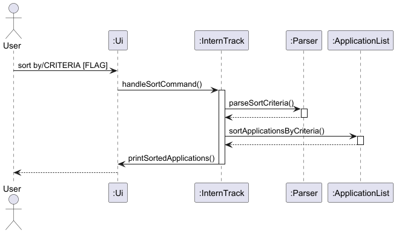

---

### Undo feature

The `undo` command allows users to revert the most recent modification made to the application list.

Supported commands:
- add
- edit
- delete

---

#### Implementation

Undo is implemented using a snapshot-based state restoration mechanism.

Before executing any modifying command:

1. A deep copy of the current `userApplications` list is created
2. The snapshot is pushed onto an undo history stack

When `undo` is executed:

1. The most recent snapshot is popped from the stack
2. The current list is cleared and replaced with the snapshot
3. The restored state is saved to storage

---

#### Deep Copy Mechanism

A deep copy is used to prevent reference sharing between states.

Each `Application` object is copied individually, ensuring that previous states remain unaffected by future changes.

---

#### Error Handling

- If no previous state exists, an error message is shown:
  "No command to undo."

---

#### Design Considerations

##### Aspect: Undo implementation strategy

**Alternative 1 (Current Choice): Snapshot-based restoration**

*Pros:*
- Simple and reliable
- Independent of command logic
- Guarantees correct state restoration

*Cons:*
- Higher memory usage

---

**Alternative 2: Command-based reversal**

*Pros:*
- More memory efficient

*Cons:*
- Complex implementation
- Each command requires custom undo logic

---

**Rationale for Current Choice:**

The snapshot approach ensures correctness and simplicity, which is more suitable for a small-scale application.

---
##### Sequence Diagram: Undo Command

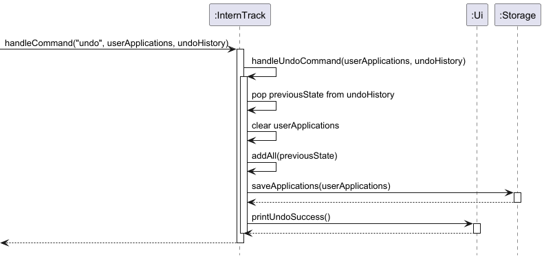

---

### Summary feature

The `summary` command provides users with a high-level overview of their internship application progress, including quantitative metrics and time-sensitive reminders.

---

#### Implementation

The summary generation is implemented as a utility-style execution within the `SummaryCommand` class. It processes the existing `userApplications` list in a single pass-through to aggregate data.

When `summary` is executed:

1. **Empty State Check**: The system checks if the application list is empty. If so, it terminates early with a notification.
2. **Total Aggregation**: The total count of applications is retrieved directly from the list size.
3. **Status Categorization**: 
    * The command iterates through all `Application` objects.
    * It uses a `HashMap<String, Integer>` to map status names to their respective frequencies.
    * Null or empty statuses are grouped under an "Unknown" label.
4. **Deadline Filtering**: 
    * The command calculates a cutoff date (Current Date + 7 days).
    * It filters applications where the deadline falls between `today` and the `cutoffDate`.
    * The remaining time is calculated using `ChronoUnit.DAYS`.

---

#### Methods

**Status Breakdown (`printStatusBreakdown`)**
This helper method ensures that even if a user adds custom statuses, the summary remains dynamic. 

**Deadline Tracking (`printUpcomingDeadlines`)**
This method focuses on immediate priority. It ignores past deadlines to reduce clutter and only highlights tasks requiring action within the upcoming week.

---

#### Error Handling

- **Empty List**: If the list contains no applications, the message "You currently have no internship applications to summarize" is displayed, and the helper methods are not called.
- **Missing Data**: If an application is missing a deadline or status, the logic gracefully skips or categorizes them as "Unknown" to prevent `NullPointerException`.

---

#### Design Considerations

##### Aspect: Summary generation strategy

**Alternative 1 (Current Choice): Real-time calculation**

*Pros:*
- Guaranteed accuracy; the summary always reflects the most recent data.
- Low memory overhead as no additional state is stored between commands.
- Simple code maintenance.

*Cons:*
- Performance could worsen if the list grows larger (e.g., thousands of entries).

---

**Alternative 2: Cached summary / Observer pattern**

*Pros:*
- Instantaneous display for very large datasets.

*Cons:*
- Increased complexity; requires the summary to "listen" for changes in the application list.

---

**Rationale for Current Choice:**

Since the typical user tracks a manageable number of internship applications (usually < 200), the calculation is nearly instantaneous and better than maintaining a cached state.

---

##### Sequence Diagram: Summary Command

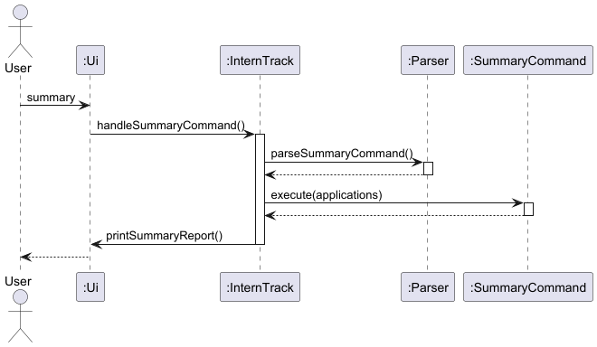

---

## Appendix: Requirements

### Product scope

#### Target user profile

InternTrack is designed for students who apply to multiple internships and need a simple way to track their
applications.

The target users are:

- university students applying for internships
- users comfortable with command-line interfaces
- applicants managing many applications simultaneously

#### Value proposition

InternTrack allows students to efficiently track internship applications from the command line.

Instead of manually maintaining spreadsheets or notes, users can quickly record, update, and filter applications using
simple commands.

The application provides a lightweight and fast way to manage internship applications without requiring a graphical
interface.

---

### User stories

| Version | As a ...                                        | I want to ...                                     | So that I can ...                                                                     |
|---------|-------------------------------------------------|---------------------------------------------------|---------------------------------------------------------------------------------------|
| v1.0    | Year-2 CEG student applying to many internships | add a new application entry with company and role | keep all applications in one place                                                    |
| v1.0    | Forgetful applicant                             | record an application deadline                    | avoid missing closing dates                                                           |
| v1.0    | Student mass-applying during peak season        | list all applications                             | see what I have already applied to                                                    |
| v1.0    | Student mass-applying during peak season        | delete an application                             | remove outdated applications                                                          |
| v1.0    | Applicant networking with recruiters            | add a recruiter or HR contact                     | follow up with the correct person                                                     |
| v1.0    | Applicant tracking progress                     | record outcomes per round                         | track application progress                                                            |
| v1.0    | Applicant mass-applying mduring peak season     | filter outcomes of the current applying season    | filter application progress                                                           |
| v2.0    | An organized student                            | sort internship applications                      | organize and view them based on criteria                                              |
| v2.0    | A forgetful student                             | set a reminder for an internship application      | focus on important dates such as interviews, deadlines, or follow-ups                 |
| v2.0    | A error-prone student                           | undo my most recent add, edit, or delete command  | easily recover from accidental mistakes                                               |
| v2.0    | A data-driven student                           | view a summary of my internship applications      | see an overview of my application statuses, upcoming deadlines, and overall progress. 

---

### Use cases

#### Use Case 1: Add and manage internship applications

**Actor:** User  
**Precondition:** Application is running  
**Postcondition:** Application data is saved to storage  

**Main Success Scenario (MSS):**
1. User adds a new internship application with company and role.
2. System validates the input.
3. System stores the application in the application list.
4. System saves the updated list to storage.
5. User lists applications to view all saved applications.
6. User edits an application to update details such as deadline, contact, or status.
7. System saves the updated list.
8. User deletes an application that is no longer relevant.
9. System saves the updated list.

#### Use Case 2: Filter and sort applications

**Actor:** User  

**Main Success Scenario (MSS):**
1. User requests to filter applications by a criterion (company, role, deadline, contact, or status).
2. System filters the application list.
3. System displays the filtered applications.
4. User requests to sort applications by a specific criterion.
5. System sorts the applications.
6. System displays the sorted list.

---

### Non-Functional Requirements

1. The application should run on any system that supports Java 17 or above.
2. The application should store application data locally in a text file.
3. The system should respond to user commands within one second for typical usage.
4. The application should provide clear error messages for invalid inputs.
5. The application should support command-line usage without requiring a graphical interface.

---

### Glossary

*Application* – A job or internship submission to a company.

*Status* – The current stage of an application (e.g., Pending, Interview, Rejected, Accepted).

*CLI* – Command Line Interface used to interact with the application.

---

## Appendix: Instructions for manual testing

### Launch and shutdown

**Launching the Application:**

1. Open a terminal/command prompt in the directory containing `InternTrack.jar`
2. Run: `java -jar InternTrack.jar`
3. The application will display a welcome message and load any previously saved data from `./data/applications.txt`
4. The terminal will be ready to accept commands

**Shutting Down the Application:**

1. Type `bye` at the command prompt
2. Press Enter
3. The application will save all data to `./data/applications.txt` and display a goodbye message
4. The application will terminate and return to the command prompt

---

### Saving data

**Prerequisite**: The application is running and has data loaded from previous sessions.

#### Test Case 1: Auto-save After Add Command

1. Run the application
2. Add a new application: `add c/Google r/SWE Intern d/2025-08-01 ct/john@google.com`
3. Verify the application appears in the list
4. **Without closing the app**, navigate to `./data/applications.txt`
5. **Expected**: The file contains a new line with the added application in the format: `Google|SWE Intern|2025-08-01|john@google.com|Pending`

#### Test Case 2: Auto-save After Edit Command

1. Run the application with existing data
2. Edit an application: `edit 1 s/Accepted`
3. Verify the status has changed in the display
4. **Without closing the app**, open `./data/applications.txt`
5. **Expected**: The first application line now has `Accepted` as the last field instead of `Pending`

#### Test Case 3: Auto-save After Delete Command

1. Run the application with at least 2 applications
2. Delete an application: `delete 1`
3. Verify it's removed from the list
4. **Without closing the app**, open `./data/applications.txt`
5. **Expected**: The file now has one fewer line (the deleted application is gone)

#### Test Case 4: Persistence Across Sessions

1. Run the application and add 2 applications:
   - `add c/Google r/SWE Intern`
   - `add c/Microsoft r/Azure Developer`
2. Verify both appear in the list
3. **Close the application** (via `exit` command)
4. **Reopen the application**
5. **Expected**: Both applications reappear in the list; data persisted correctly

---

#### Error Handling: Corrupted Data

**Scenario 1: Missing Data Directory**

1. Delete the `./data/` directory entirely
2. Run the application
3. **Expected**: 
   - Directory is recreated automatically
   - `applications.txt` is created as an empty file
   - Application starts with an empty list (no crash)
   - Console log shows: `INFO: Created data directory: ...`

---

**Scenario 2: Missing Applications File**

1. Delete `./data/applications.txt` (but keep the `./data/` directory)
2. Run the application
3. **Expected**: 
   - File is recreated automatically
   - Application starts with an empty list
   - Console log shows: `INFO: Created new applications file: ./data/applications.txt`

---

**Scenario 3: Malformed Line (Wrong Number of Fields)**

1. Manually edit `./data/applications.txt` and add a corrupted line: `Google|SWE Intern|2025-08-01`
   (only 3 fields instead of 5)
2. Run the application
3. **Expected**: 
   - Application starts successfully with other valid data
   - Malformed line is skipped
   - Console log shows: `WARNING: Skipping malformed application record: Google|SWE Intern|2025-08-01`

---

**Scenario 4: Unparseable Date Field**

1. Manually edit `./data/applications.txt` and add a line with an invalid date: `Google|SWE Intern|NOT-A-DATE|john@google.com|Pending`
2. Run the application
3. **Expected**: 
   - Application starts successfully
   - Line with invalid date is skipped
   - Console log shows: `WARNING: Skipping invalid application record: ...`

---

**Scenario 5: Null/Missing Optional Fields**

1. Manually add a line with optional fields as `null`: `Google|SWE Intern|null|null|Pending`
2. Run the application
3. **Expected**: 
   - Application loads successfully
   - Application is displayed correctly with no deadline and no contact information

---

**Scenario 6: Completely Corrupted File**

1. Replace the entire contents of `./data/applications.txt` with random text (e.g., "CORRUPTED DATA 12345")
2. Run the application
3. **Expected**: 
   - Application starts with an empty list (no crash)
   - All corrupted lines are skipped with warnings
   - User can continue using the application and add new data

---

